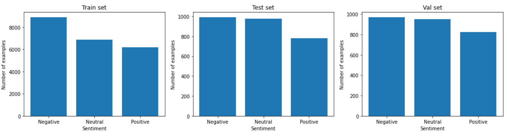
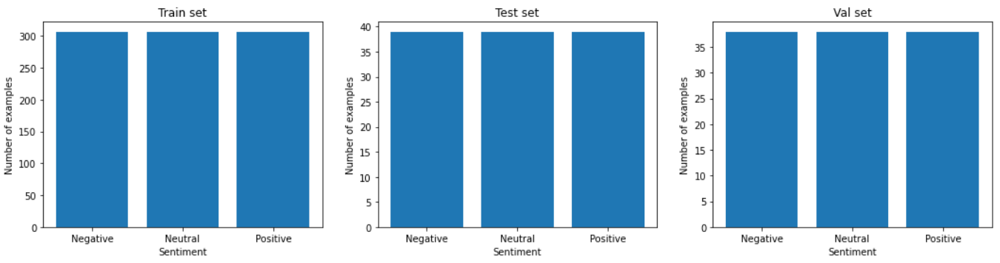

# Twitter-Sentiment-Analysis-RoBERTa
Sentiment Analysis of tweets written in underused Slavic languages (Serbian, Bosnian and Croatian) using pretrained multilingual RoBERTa based model XLM-R on 2 different datasets.

# Data
Sentiment Analysis is performed on 2 different datasets separately (I decided not to join the datasets, because I wanted to compare my results with the similar work): 
1. **CLARIN.SI** - Twitter sentiment for 15 European languages: 
Dataset can be found [here](https://www.clarin.si/repository/xmlui/handle/11356/1054). It consits of tweet IDs, which can be used for extraction of tweets through the [Tweeter API](https://developer.twitter.com/en/docs/twitter-api), and corresponding labels (positive, negative or neutral). From this dataset only Serbian, Croatian and Bosnian tweets were used. 
Note that this dataset is 5 years old so we won't be able to extract the large number of tweets, because they are deleted. I have managed to extract only 27439 tweets out of 193827.  
Similar work on the same dataset can be found [here](https://journals.plos.org/plosone/article?id=10.1371/journal.pone.0155036). They achieved **55.9%** accuracy on the dataset that consits of 193827 Serbian, Bosnian and Croatian tweets. 
2. **doiSerbia**: 
This dataset is collected by Ljajić Adela and Marović Ulfeta and there work on the same problem can be found [here](http://www.doiserbia.nb.rs/img/doi/1820-0214/2019/1820-02141800013L.pdf). They achieved **69.693%** accuracy. Dataset is balanced and it consists out of only **1152** labeled tweets, written in Serbian language. The labels are 0 = positive, 2 = neutral and 4 = negative. Text of the tweets is not provided and can be extracted through the [Twitter API](https://developer.twitter.com/en/docs/twitter-api) using tweet IDs.

# Twitter API
Since the datasets contain only tweet IDs, and not the text of the tweets, we need to extract the text thorugh the Twitter API using tweepy package. 
You first need to create developer account for Twitter API. After you file in a request you will need to wait a few days for approval. When your request is approved you have to download **API key, API secret key, Access token and Access token secret**. My keys are placed in *keys.txt* file which will not be provided due to privacy and security issues.

# Preprocessing
* (CLARIN.SI only) There are a lot of NaN rows, because multiple tweets are deleted, so they are dropped.
* (CLARIN.SI only) Because some of the tweets were annotated multiple times by the same annotator, there can be duplicated rows. We first need to drop all rows, but one, with duplicated tweets where *HandLabel* is the same. After that we drop all duplicated tweets, since they all have different *HandLabel* and we do not know which one is correct. It would have been wrong if we dropped all the duplicates at once, without looking at the *HandLabel*, because we would threw away the highest quality data (the tweets which were labeled same multiple times).
* All tweets are converted to lowercase
* All links were removed since they do not contain any relevant information for this task and also '[video]' and '{link}' strings were removed because Twitter sometimes converts links to to these keywords.
* A lot of tweets are usually retweets, that means that they contain 'RT @tweet_user' keywords, since 'RT @' is of no use it is replaces by '@'. ('@' is kept as indicator of tweet_user, because we will be removing them in the following steps).
* All usernames are removed. Usernames are words that start with '@'.
* Dealing with hashtags: Hashtag symbol '#' is removed, but the words that follow that symbol are kept, since they usually contain a lot of useful information (they are usualy compressed representation of the tweet). Since those words are connected with '_' character, this character is converted to blank space ' ' character.
* Datasets are finally splitted into train, val and test sets (80%, 10% and 10%) and schuffled randomly.<br /

CLARIN.SI | doiSerbia
:--------:|:---------:
  | 
# Model

